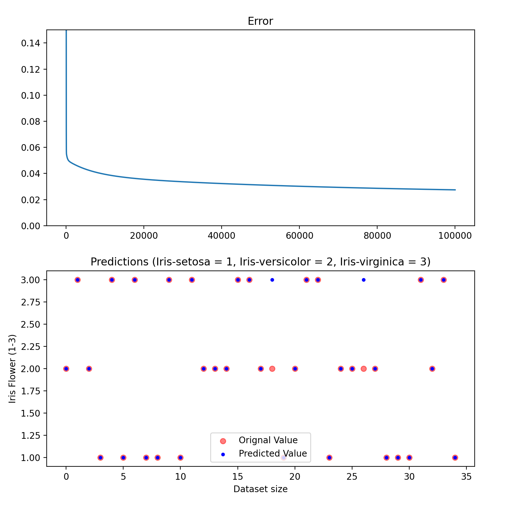

# Multivariate Case in Linear Regression

Following is an impementation of Classification using Linear Regression problem. Data set used in this problem is the Iris Data set.

## Section One 
### Importing data and encoding target values.

Data is imported using Python's Pandas library.
```
dataFrame = pd.read_csv("iris.csv")
```
After importing the dataset, target values in the dataset are mapped to numerical values.
```
mapping = {
    'Iris-setosa': 1,
    'Iris-versicolor': 2,
    'Iris-virginica': 3
}
```
The updated data sample will look like

| SepalLength | SepalWidth | PetalLength| PetalWidth | Species|
| ----------- | ----------- | ----------- | ----------- |----------- |
| 5.1|3.5|1.4|0.2|1|
| 5.8|2.7|5.1|1.9|3|

## Section Two 
### Splitting the dataset using Cross Validation techniques
To crate a *balanced* Test and Train data, the dataset needs to be shuffled. To shuffle a Pandas dataFrame we use the ```df.sample()``` method.
```
df = df.sample(frac=1, ignore_index=True)
```
To easily split the dataset into two sets we can use Python *Slicing*.
```
trainDF = Sdf[:115]
testDF = Sdf[115:]
```
## Section three
### Training The model
In this section we are implementing the Multivariate Case Formula, ```F(theta) = ([Theta] * [X]-[Y]).Transpose ([Theta] * [X]-[Y])```.
Here we minimize Theta by calculating the Error. On each epoch the Theata value is adjusted until an accurate result is produced.

## Result

Error over Epochs & Accuracy of the Model.



